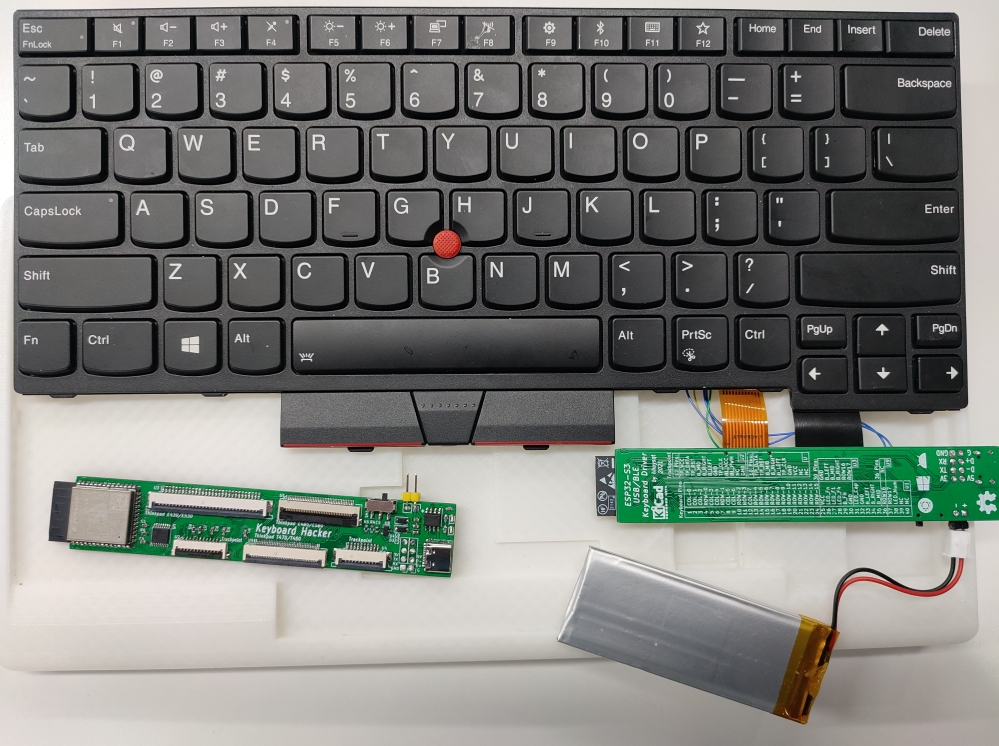
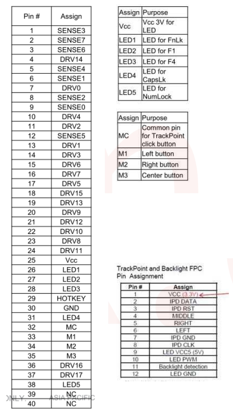
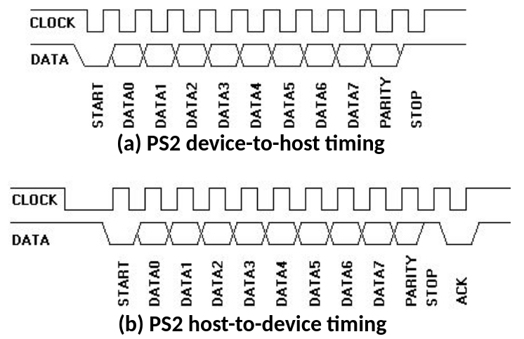

# Thinkpad USB/BLE keyboard based on ESP32S3

This USB/BLE keyboard controller is built upon ESP32S3 (the ESP32S3-WROOM-1 module), which has hardware USB & BLE peripherals. It can support multiple Thinkpad laptop keyboards, if not limited to all sorts of matrix keyboards. The following functions are supported:

- Keyboard & LED;
- Mouse (trackpoint);
- Fn consumer/multimedia keys;
- USB & BLE connection;
- "Low-power": around 6-day BLE connection on a 1500mAh battery;

Tested on T440/T470/E430/E530/E580.

- E580 keyboard with 3D printed case:


- T470/T480 keyboard:


The BLE and USB driver is mainly modified from:
- [ble_hid_device_demo](https://github.com/espressif/esp-idf/tree/master/examples/bluetooth/bluedroid/ble/ble_hid_device_demo) in `esp-idf`;
- [tinyusb hid](https://github.com/iot-components/tinyusb.git) component addon;

## Hardware

The Thinkpad keyboard modules are similar. Usually it contains a 32-40 pins FPC cable for keyboard matrix and LEDs, and a 10-12 FPC cable for trackpoint, mouse buttons and backlight. The keyboard matrix comprises 24 or 26 pins, where 8 of them are sense ports and the remaining drive ports. The trackpoint contains 3 input ports for mouse buttons, and a PS2 interface for mouse report. The following pinout is extracted from the [E580](https://badcaps.net/forum/attachment.php?attachmentid=215193&d=1593808132) schematic.



Although ESP32 has no PS2 interface, we notice that the slave-to-host timing of PS2 DATA pin is identical to the UART (1 start bit, 8 data bit, 1 odd parity, 1 stop bit). While by contrast the host-to-slave timing is NOT compatible, this only happens during initialization. Thereby this step requires bit-banging.



The ESP32S3-WROOM-1 module has 36 GPIOs, among which should reserve the USB port (IO19/20), and the 32.768kHz external oscillator for low-power modem sleep (IO15/16). To fully drive the keyboard matrix, LEDs and PS2 trackpoint mouse, a 74HC138 is used to expand the poor IOs... See the [schematic](hardware/esp32_keyboard.pdf) for detail.
- Keyboard: 3 pins for column scanning with 74HC138, plus 18 pins for row sensing;
- Trackpoint: 3 pins (RST, CLK, DATA);
- LEDs: 4 pins (FnLock, CapLk, NumLk, F1, mux with the UART0), plus 1 pin for the keyboard backlight;
- Hotkey/Fn: 1 pin;
- 5V wake up: 1 pin;
- Download Pin: IO0, connected to the middle button;

## Build & Run

We build with the normal esp-idf project workflow on Linux:

```bash
idf.py set-target esp32s3
idf.py build
```

To update the firmware, we should first power off the board, hold the middle button, plug in the USB cable, and then we can release the button. The USB-CDC hardware in the ESP32S3 should launch a `/dev/ttyACMx` on your computer, which can be used to flash the firmware:

``` bash
idf.py -p /dev/ttyACM0 flash
```

Finally, unplug the USB cable and power on the board.

## Power consumption

The ESP32 is known to be power hungry... We use a 1500mAH battery for the keyboard, and the original `ble_hid_device_demo` would take over 100mA without midification, which means a poor 15-hour battery life. For lower-power design, we should adopt the [BLE modem sleep with external 32kHz crystal under light sleep](https://github.com/espressif/esp-idf/issues/947#issuecomment-500312453), which claims an average ~2mA current with ~1000ms BLE connection interval. However, 1000ms (1Hz) interval is too long for real-time keyboard response, and we have to decrease it to around 50ms (20Hz) for normal use. Moreover, the trackpoint/mouse requires a even shorter period, which we set to 12.5ms (80Hz). With this backdrop, we develop a multi-stage power management as follow. This can be configured in [keyboard_pm.c](main/keyboard_pm.c).

| Charging | BLE Connect | Keyboard Scanning | Trackpoint | BLE Interval | Current | Duration |
|--|--|--|--|--|--|--|
| No | No | Slow | No | 1000ms | ~5mA | - |
| No | Yes | Slow | No | 1000ms | ~8mA | - |
| No | Yes | Slow | No | 400ms | 13mA | 120s |
| No | Yes | Fast | No | 50ms | 30mA | 240s |
| No | Yes | Fast | Yes (cannot sleep) | 12.5ms | 53mA | 120s |
| Yes | - | - | - | - | -500mA | - |

Note:
- The ESP32 light sleep would force turning off all the peripherals, which means that we will never receive trackpoint message at sleep. So the trackpoint forces no sleep.
- The USB 2.0 host could offer ~500mA current, which means that it takes 3 hours to charge the 1500mAh battery. This is quite a modest setting, and this is why we don't use a larger battery like 2500mAh.
- Backlight takes an additional 50mA.

Battery life estimation (1500mAh):
- 12 days if no BLE connection;
- ~6 days for normal use;

## TODO list

- Online configuration;
- `Fn` and `Left Ctrl` exchange;
- Multiple BLE cnnection;
- More keyboards, e.g. X220;
- More OS support, e.g. Mac;

## Reference

- [How to Make a USB Laptop Keyboard Controller](https://www.instructables.com/How-to-Make-a-USB-Laptop-Keyboard-Controller/)
- [Laptop Touchpad/Trackpoint Conversion to USB](https://www.hackster.io/frank-adams/laptop-touchpad-trackpoint-conversion-to-usb-d70519)
- [esp32 BLE bridge for mouse and keyboard](https://github.com/asterics/esp32_mouse_keyboard)
- [HID scancodes](https://deskthority.net/wiki/Scancode#cite_ref-xmeta_13-0)
- [Trackpoint hardware](https://deskthority.net/wiki/TrackPoint_Hardware)

Thinkpad schematics:
- [T440](https://drive.google.com/file/d/1L-NCRwoP0IHYmOoxbS2U5ZWHYhyHf4xC/view)
- [T470](https://www.badcaps.net/forum/attachment.php?attachmentid=201515&d=1571565529)
- [E430/E530](https://drive.google.com/file/d/0B6IqcVTk0jpYV0xfMUdOay1uWlE/view?resourcekey=0-oamnnXMgSrohielovUks4A)
- [E580](https://badcaps.net/forum/attachment.php?attachmentid=215193&d=1593808132)
